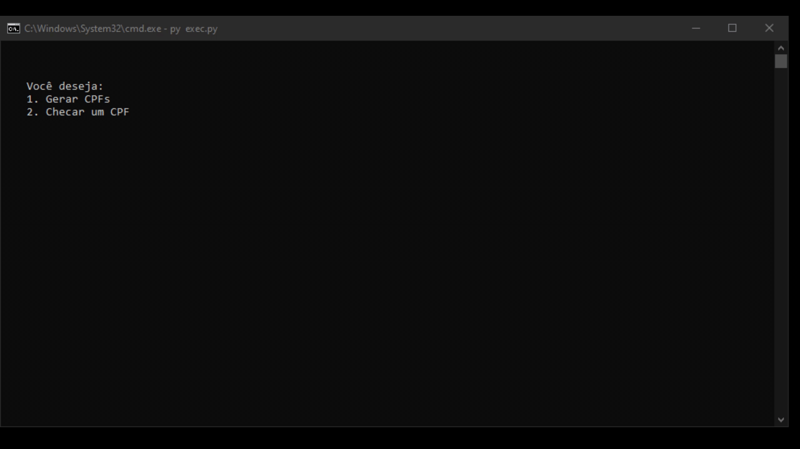

# Gerador e Checker de CPF
Um script em python que checa e gera CPFs



## Atenção
Esse script não dá a total certeza se o CPF é válido ou não, ele valida ou invalida baseado nos padrões de CPF brasileiros.

## Modos de uso
Você pode instalar a package com ``pip install cpf`` e importar ou baixar e utilizar ``exec.py`` ou a [versão compilada disponível nas releases](https://github.com/pedrokpp/gerador-e-checker-de-cpf/releases/download/2.0/cpf.exe)

## Funções
Para usar, basta ``pip install cpf`` e depois importar com ``import cpf``

- ``checar(cpf, regiao)``

Checa um CPF.

Se nenhum CPF for passado como parametro ``str``, um ``input()`` será pedido.

Retorna ``True`` quando um CPF é válido e ``False`` quando é inválido

``regiao`` é um parametro ``bool`` o qual checará ou não a região do CPF retornado em ``stdout``. ``False`` é o valor padrão e a região não será checada.

-----

- ``gerar(quantidade, regiao)``

Gera um CPF aleatório.

Retorna uma **lista** com os CPFs gerados (já checados).

``quantidade`` é um parametro ``int`` que remete a quantos CPFs serão gerados. ``1`` é o valor padrão e será gerado apenas 1 CPF.

``regiao`` é um parametro ``int`` que remete à região cujos CPFs serão gerados. ``-1`` é o valor padrão e será utilizado uma região aleatória.

## Exemplos
```python
import cpf
print(cpf.checar("136.718.360-08"))
# output: False

print(cpf.checar("13671836008"))
# output: False

print(cpf.checar("896.163.770-35"))
# output: True

print(cpf.checar("89616377035"))
# output: True

print(cpf.checar('540.417.553-19',True))
# output: 
# Regiões: Ceará – Maranhão – Piauí
# True

print(cpf.checar('54041755319',True))
# output: 
# Regiões: Ceará – Maranhão – Piauí
# True

print(cpf.gerar())
# output: ['969.960.854-37']

print(cpf.gerar(5))
# output: ['245.444.659-66', '202.716.007-80', '959.350.384-18', '004.840.618-49', '630.731.918-60']

print(cpf.checar(cpf.gerar()[0]))
# output: True

print(cpf.gerar(7,3))
# output: ['540.417.553-19', '230.756.233-67', '347.396.663-35', '740.025.963-44', '971.494.693-59', '100.194.413-28', '551.717.343-35'] 

```

## Regiões

- 0:  Rio Grande do Sul    

- 1:  Distrito Federal – Goiás – Mato Grosso – Mato Grosso do Sul – Tocantins    

- 2:  Pará – Amazonas – Acre – Amapá – Rondônia – Roraima    

- 3:  Ceará – Maranhão – Piauí    

- 4:  Pernambuco – Rio Grande do Norte – Paraíba – Alagoas    

- 5:  Bahia – Sergipe    

- 6:  Minas Gerais    

- 7:  Rio de Janeiro – Espírito Santo

- 8:  São Paulo

- 9: Paraná – Santa Catarina


## Features
- [x] Checker
- [x] Gerador
- [x] Adicionar opção de região e reconhecimento de região
- [ ] Escolher formatar ou não os CPFs gerados
- [ ] Opção de região por nome ao invés de números
- [ ] Versão em API
